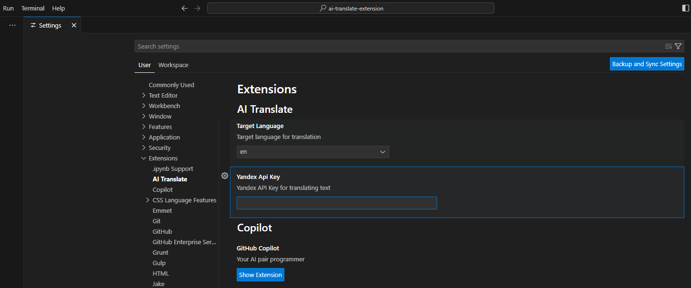

# ai-translate README

## Features

This extension allows to translate any selected text.

1. Select some text.
2. Open Command palette with `Ctrl`+`Shift`+`P`
3. Search for `ai translate`
4. Run command
5. Translated text and validated translations will appear as notification

## Requirements

You should get [Yandex Api-Key](https://yandex.cloud/ru/docs/iam/operations/api-key/create) for local usage

## Extension Settings

To configure extension got to File -> Preferences -> Settings -> Extensions -> AI Translate

1. You can select language to which selected text will be translated. Available: English(en), Russian(ru), Chinese(ch).
2. You can set up your YANDEX API KEY for translating text

## Launching locally from VSCode

1. Make sure you have Node.js and Git installed
2. Clone this repository
3. Launch VSCode
4. Select File -> Open Folder
5. Choose folder where you cloned the repository
6. Open Terminal and Run `npm install` to install the dependencies
7. Create folder .vscode
8. Move files launch.json and tasks.json from .vscode.example folder to .vscode folder
9. Select Run -> Start Debugging or Select Run and Debug from sidebar and click on Launch Ext

## Install from VSIX

1. Download latest plugin version(.vsix file) from releases
2. Launch VSCode
3. Go to File -> Preferences -> Extensions or Select Extensions from sidebar
4. Click Views and More Actions...
5. Select Install from VSIX
6. Choose downloaded .vsix file

## Release Notes

### v1.0.0

Initial release of ai-translate extension.

**Enjoy!**
