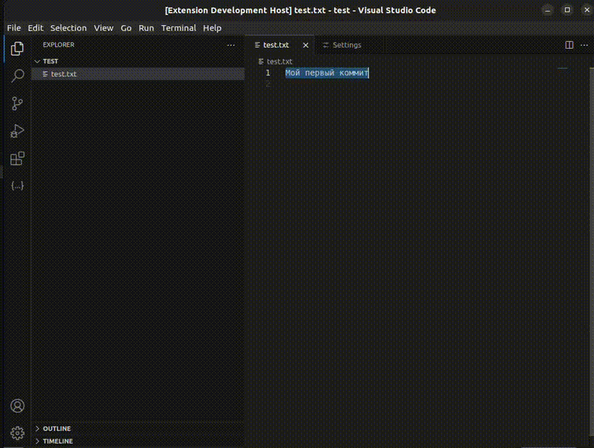

# ai-translate README

## Features

This extension allows to translate any selected text.

1. Select some text.
2. Open Command palette with `Ctrl`+`Shift`+`P`
3. Search for `ai translate`
4. Run command
5. Translated text and validated translations will appear as notification

## Requirements

You should get [Yandex Api-Key](https://yandex.cloud/ru/docs/iam/operations/api-key/create) for local usage and set it as `YANDEX_API_KEY` environment variable.

## Extension Settings

This extension contributes the following settings:

* `ai-translate.targetLanguage`: Target language for translation. Available: English, Russian, Chinese. Default: English.

## Release Notes

### 1.0.0

Initial release of ai-translate extension.

**Enjoy!**
